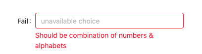

# 不得不面对的表单校验

## 序

表单校验对于 FEer 来说应该都不陌生，那些年我们校验过的表单可能都比执行```npm install```还多。对于服务 B 端业务的童鞋而言，表单校验更不是什么不能说的秘密了，已经是家常便饭了。既然不得不面对，那来盘一盘它。

关于这个话题从以下两个大方向展开阐述：
1. 表单校验现有的痛点
2. 针对现有的痛点如何去改进

## 表单校验现有的痛点
1. 组件库提供的表单校验不是那么符合业务需求
2. 校验在各个分散的组件中耦合程度过深
3. 前后端使用的正则表达式略有差异

#### 1. 组件库提供的表单校验不是那么符合业务需求
现有的新兴业务前端几乎都是围绕 Vue、React 等进行构建视图层，其对应都有各自盛行的组件库。React 的 组件库有 Ant Design、React Bootstrap、React WeUI、Semantic-UI-React...等，Vue 的有 Element UI、Vant...等。现有的组件库内置的表单校验大部分都以如下图的形式：  

  

虽说以上校验能满足大部分业务需求，但它的灵活度较小，并不能满足所有的业务需求，比如说，错误提示消息需要全局提示呢？  

  

大部分组件提供的校验方式就不合适了。此外，组件库还有的不提供实际的校验，还需要依赖其他第三方库。无论是组件库提供的校验方式比较单一，灵活度较小，还是干脆就不提供校验由用户自行处理，总的来说，组件库提供的表单校验不是那么符合业务需求。

#### 2. 校验在各个分散的组件中耦合程度过深
既然组件库不提供表单验证功能或者提供的不贴切业务需求，很自然想到的就是自己动手实现，加上表单验证又不是什么棘手的问题。但正是如此，又带来了另外可能产生的复杂度。在分散的业务组件中直接就使用大量```if ```语句进行校验，如果整个项目表单字段不多问题还不大，但如果整个项目表单字段数目略为庞大，不仅判断逻辑重复率高，而且不容易维护正则表达式，牵一发而动全身。但这里并不是否认自己动手，而是说实现起来还可以更优雅，具体怎么做后文再说。

#### 3. 前后端使用的正则表达式略有差异
实际业务过程中还面临一个前后端使用的正则表达式不一致的问题。面对同一个业务需求，各方存在理解的差异是不可避免的，只能通过辅助手段、沟通一点点缩小差异。一个具体的软件产品可以说是产品、设计师、前端、后端等人员共同认知产出的东西，用《三体》中的名词解释就是“集体想象”。⽆论是国家、宗教，还是法律、习俗，可以说都是⼈们达成的“集体想象”。如果哪方“想象”出现偏差必然最后的产出必然会不太理想。比如说，表单有需要校验“邮箱”这个字段，后端使用自己的理解那一套邮箱规则，前端也是使用自己理解的一套邮箱规则，邮箱规则大部分都一致，但细节还会存在认知差异，如果前端使用的规则所匹配是后端使用的规则匹配的子集还好，若是超集，且后端也没返回具体额的错误提示，那用户使用起来可能就面临困惑的场景。

## 针对现有痛点的改进

#### 1. 自己动手，丰衣足食
上述所列的痛点中，第一条和第二条痛点有逻辑上的联系，可以集中解决。解决也不是什么难事，最后大部分的实现都是抽出公共逻辑全局共享。无论是自己实现还是去找第三方库，完全是自己动手就能做到的事，不必完全只能依赖组件库。那接下来可以看看自己动手该如何实现。

#### 2. 使用策略模式去更好实现
什么是策略模式？
> 策略模式作为一种软件设计模式，指对象有某个行为，但是在不同的场景中，该行为有不同的实现算法。

更多策略模式具体内容可以另外去了解，这里不展开叙述。

表单校验中不同字段的校验使用了不同的正则表达式，不同的表达式校验可以视为不同的策略，将策略集中管理、配置，然后通过某种形式去匹配策略列表。那某种形式是什么呢？工具函数的执行力就完全能胜任这事。清楚了要实现的形式，那这工具函数长什么样呢？我们需要从实际业务场景出发去考量它需要达到的目标。

- 单条正则去匹配单个值
- 多条正则去匹配单个值
- 多条正则去匹配多个值

基于以上的思考，实现一个使用简单，功能齐全的迷你表单验证工具函数库。具体实现及使用请移步：[https://github.com/iyolee/validator-form](https://github.com/iyolee/validator-form)，欢迎 Star 或 PR，一起将它打造得更加顺手，提高工作效率。

该工具函数有如下特点：
- 使用简单，学习成本几乎为零
- 没有依赖其他第三方库，引入成本几乎为零
- 测试用例覆盖率达 100%
- 检验粒度更小，自由度更高
- 全局统一管理、配置所有的正则策略
- 良好的使用错误提示

#### 3. 维护一份团队公共的正则表达式列表
人的认知是会存在偏差的，但可以借助沟通、工具、手段去达成某方面认知的统一。如果每次遇到这件事都需要沟通，显然成本太大，那只能依靠手段去解决前后端使用的正则表达式略有差异这一痛点。讲真，程序员之间对正则表达式的掌握程度真是“各有千秋”，很多时候可能是需要用到某一个直接就去通过搜索引擎获得。如果维护一份团队常用的正则表达式列表，不仅能解决不同人因对规则理解不同造成写出的正则表达式有差异，还能解决团队成员对正则掌握能力不同导致使用了不合理的正则表达式。

可以维护如下团队公共正则表达式列表（仅供参考）：

[https://github.com/iyolee/validator-form/blob/master/docs/regexp.md](https://github.com/iyolee/validator-form/blob/master/docs/regexp.md)

另外，有一个不错的正则表达式学习网站[https://regexper.com](https://regexper.com/) (貌似尤雨溪也推荐过？)

## 总结
表单校验这件事无论从项目，还是工程角度去看，似乎是件不值一提的事。尽管如此，如果没有去正视它，只有一顿猛如虎的操作，那它依然还是一个痛点。少一个痛点，还世界多一点美好。

## 最后
写这篇东西完全是抱着学习的态度，若大家对这方面有不错的实践或思考，欢迎交流讨论。若上面所述，有不妥及欠缺的部分，也欢迎斧正。
